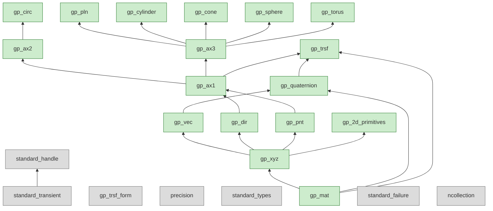

# plan — OCCT → Rust migration map

← [index](../index.md) · generated 2026-07-27 by trellis-plan

## 1. Start here — Layer 0 frontier

8 units ready with no unresolved dependencies. These are drivable and cheaply verifiable:

| Priority | Unit | Type | Oracle | Effort | Why first |
|---|---|---|---|---|---|
| 1 | `gp_mat` | 3×3 matrix | numeric_tol | S | Root of all gp math. gp_XYZ::Multiply depends on it. 18 downstream callers. |
| 2 | `gp_trsf_form` | enum | bit_equal | S | Pure enum, 1 file, zero deps. Unblocks gp_trsf. |
| 3 | `precision` | constants | bit_equal | S | Tolerance values used by every gp type. Must exist before any port that checks tolerances. |
| 4 | `standard_types` | type aliases | bit_equal | S | Clarifies usize/u8/bool usage across the port. |
| 5 | `gp_xyz` | 3D coordinate | numeric_tol | S | Core of every gp value type. Delay Multiply(gp_Mat) until gp_mat exists. |
| 6 | `gp_vec` | 3D vector | numeric_tol | S | gp_XYZ wrapper. Delay gp_Dir constructor. |
| 7 | `gp_dir` | unit direction | numeric_tol | M | Normalization logic. Depends on gp::Resolution (C10). Delay gp_Vec constructor. |
| 8 | `gp_pnt` | 3D point | numeric_tol | S | Most-called type in OCCT (710 callers). Delay Transform/Rotate until gp_trsf exists. |

**Recommended first spec:** `gp_mat` → `precision` → `gp_xyz` (core). These three unlock the rest.

## 2. Dependency backbone (CMake-verified, codegraph-cross-checked)

```
TKernel ──→ TKMath ──→ TKG2d ──→ TKG3d ──→ TKGeomBase ──→ TKBRep
  │            │
  │   ┌────────┼────────┐
  │   ▼        ▼        ▼
  │  gp_mat  gp_xyz  precision
  │   │        │
  │   │   ┌────┼────┐
  │   │   ▼    ▼    ▼
  │   │ gp_vec gp_dir gp_pnt
  │   │   │    │     │
  │   │   │    ├──gp_ax1──┬──gp_ax2──gp_circ
  │   │   │    │          └──gp_ax3──gp_pln, gp_cylinder, gp_cone, gp_sphere, gp_torus
  │   │   │    │
  │   │   └─gp_quaternion
  │   │        │
  │   │      gp_trsf (gate: gp_ax1, gp_quaternion)
  │   │
  │   ├── standard_types, standard_failure, standard_transient, standard_handle
  │   ├── NCollection containers
  │   └── Message, OSD, Resource, Units (deferred to trellis-spec)
  │
  ▼
ModelingData (deferred: TKG2d, TKG3d, TKGeomBase, TKBRep)
```

**CMake confirms:** TKMath depends only on TKernel. TKG2d depends on TKMath + TKernel. This matches the codegraph call-graph — no FoundationClasses gp type calls upward into ModelingData.

### Circular dependencies found (2, both manageable)

| Cycle | Why | Resolution |
|---|---|---|
| `gp_Vec ↔ gp_Dir` | Mutual constructors: Vec from Dir copies XYZ; Dir from Vec normalizes | Port both with gp_XYZ wrapper only; add From impls after both exist |
| `gp_Mat ↔ gp_XYZ` | Mat::Column/Row return gp_XYZ; XYZ::Multiply takes gp_Mat | Port gp_Mat core first; port gp_XYZ without Multiply(gp_Mat); add cross-methods in phase 2 |

## 3. Per-region verification strategy

### wide — gp types, math primitives (~85% autonomous)

**Serialization form:** `ok <x> <y> <z> ...` (space-separated f64) or `ok {"x":..., "y":..., "z":...}` (JSON for struct_tol)

**Oracle:** `numeric_tol` (abs=1e-9, rel=1e-12) for vector math. `struct_tol` for transforms and composite shapes.

**Verification:** Random corpus generation (see geometry harness pattern: ~4000 random inputs). Negative control with known edge cases (zero vectors, degenerate axes, gimbal lock quaternions).

**Status:** ✅ Ready. differ.py supports both strategies.

### repl — type aliases, handles, containers

**Oracle:** `bit_equal` — byte-for-byte identical output. Constants compare exact; handle operations either match or don't.

**Verification:** Exact-match test vectors. No tolerance.

**Status:** ✅ Ready.

### deep — topological algorithms, boolean ops (Layer 2+, deferred)

**Status:** 🚧 Blocked. Needs invariant oracle (not yet in differ.py). The `## Deferred` section in _rules.md covers all deep regions.

## 4. Gates — what must exist before deeper regions can start

| Gate | Blocks | What it provides |
|---|---|---|
| G1: `invariant` oracle | All deep regions (ModelingAlgorithms boolean ops, fillets, mesh) | Topological invariant checking: Euler characteristic, manifold-ness, non-self-intersection |
| G2: Handle protocol (`standard_handle`) | TKG3d, TKGeomBase, TKBRep, all OCAF | Arc-based Handle(T) equivalent — all geometry and topology objects use it |
| G3: DumpJson protocol | All wide/trans units with struct_tol oracle | JSON round-trip for composite type comparison. serde_json works if precision matches. |
| G4: NCollection port | All higher layers | Vec, HashMap, LinkedList equivalents. Stdlib covers most; flat_map needs impl. |

**Gate priority:** G2 (handle) → G3 (DumpJson) → G1 (invariant) → G4 (NCollection). G4 can run in parallel since stdlib covers most needs.

## 5. Risks

| # | Risk | Severity | Source | Mitigation |
|---|---|---|---|---|
| R1 | **gp_Dir normalization divergence** — sqrt precision differs between platforms/compilers for edge cases (near-zero norm, near-unit vectors) | HIGH | `_rules.md` F5, C10 | Use `f64::sqrt` which is IEEE 754 compliant. Test with subnormal inputs. |
| R2 | **gp_Trsf composition order** — OCCT uses T = T * R convention (pre-multiply vs post-multiply). Getting this wrong silently produces correct-looking but wrong transforms. | HIGH | `code-flow.json` edge: SetRotation(Ax1) | Verify against OCCT reference with non-commuting transforms. Add composition-order test vectors. |
| R3 | **gp_Mat::Invert divergence** — 3×3 matrix inversion uses determinant; nearly-singular matrices produce large errors amplified by downstream algorithm chains. | MEDIUM | `gp_Mat.cxx:283` | Test with ill-conditioned matrices (condition number > 1e6). Agree on error bound with numeric_tol. |
| R4 | **Missing invariant oracle** — blocks all deep regions (ModelingAlgorithms). Cannot verify boolean ops, fillets, or mesh without topological invariant checking. | HIGH | `_rules.md` ## Deferred | Add `invariant` strategy to differ.py. Define topological checks (closed, manifold, non-self-intersecting). |
| R5 | **Handle protocol fidelity** — OCCT handle is intrusive_ptr with custom RTTI (DynamicType, IsKind). If port uses Arc without RTTI equivalent, downstream code that does dynamic_cast breaks. | MEDIUM | `_rules.md` I1, I2, F4 | Use enum-based dispatch for known type hierarchies. Add RTTI only if needed by algorithm code. |
| R6 | **Scale of gp_Pnt callers** — 710 call sites across every layer. Any interface mistake in gp_Pnt ripples everywhere. | LOW | codegraph blast-radius | Implement as newtype over gp_XYZ with Deref. Keep API surface minimal (core ops first, transform methods later). |

## 6. Effort shape

| Layer | S | M | L | XL | Pattern |
|---|---|---|---|---|---|
| Layer 0 (gp types) | 8 | 5 | 0 | 0 | Assembly-line — 85% autonomous |
| Layer 0 (Standard + repl) | 3 | 4 | 0 | 0 | Replace with stdlib |
| Layer 1 (math + NCollection) | 3 | 2 | 1 | 0 | Semi-autonomous (ncollection is large) |
| Layers 2-6 (ModelingData+) | — | — | — | — | Deferred to trellis-spec |

**Assembly-line throughput:** Layer 0's 13 S-atoms can be parallelized. The 5 M-atoms (gp_dir, gp_ax2, gp_ax3, gp_trsf, gp_quaternion) are gated by their S-atom deps but independent of each other beyond that.

## 7. Rule coverage

| Metric | Count |
|---|---|
| Atoms with rule refs | 11 / 21 (Layer 0) |
| Atoms without rule refs | 10 (gp_ax1, gp_ax2, gp_ax3, gp_circ, gp_pln, gp_cylinder, gp_cone, gp_sphere, gp_torus, gp_mat) |
| Rule gaps flagged | 5 (gp_TrsfForm enum, gp_Ax1/Ax2/Ax3 types, elementary shape types, gp_Mat↔gp_XYZ mutual dep not in _rules.md, gp_Vec↔gp_Dir mutual dep not in _rules.md) |
| Broken rule refs | 1 (gp_trsf references F6 [Cross aliasing] — weak ref; F6 is about gp_XYZ::Cross, only tangentially relevant) |

**Gap priority:** Add gp_TrsfForm to type map. Document gp_Mat↔gp_XYZ and gp_Vec↔gp_Dir mutual deps in _rules.md idioms section. The remaining gaps (elementary shape types) follow the same newtype-over-XYZ pattern as existing entries — fill during trellis-spec.

## 8. Progress checkpoint

```
24 units · 0 done · 8 frontier ready
Ready: gp_mat, gp_trsf_form, ncollection, precision, standard_failure,
       standard_transient, standard_types, gp_xyz
```



---

*Next: `/trellis:map` picks the first ready atom. `/trellis:spec → port → verify` is the incremental loop.*
